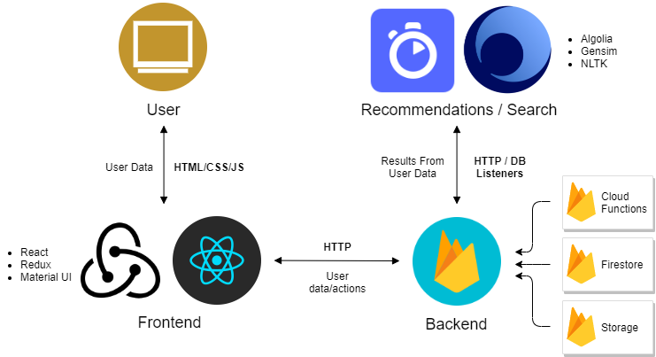

<!-- PROJECT LOGO -->
<br />
<p align="center">
  <a href="https://github.com/DSC-UIUC/research-bay">
    
  </a>

  <h3 align="center">Research Bay</h3>

  <p align="center">
    A web platform for efficiently connecting students to research opportunities and professors
    <br />
    <a href="https://github.com/DSC-UIUC/research-bay"><strong>Live Website (Soon)</strong></a>
    <br />
    <br />
    Code Repository Links
    <br />
    <a href="https://github.com/DSC-UIUC/rbay-frontend">Frontend</a>
    ·
    <a href="https://github.com/DSC-UIUC/rbay-backend">Backend</a>
    ·
    <a href="https://github.com/DSC-UIUC/rbay-data-ml">Data/ML</a>
  </p>
</p>


## Table of Contents

* [About](#about)
  * [Background](#background)
  * [Solution](#solution)
  * [DSC Solution Challenge](#dsc-solution-challenge)
  * [Structure](#structure)
  * [Technologies](#technologies)
* [Getting Started](#getting-started)
  * [Prerequisites](#prerequisites)
  * [Installation](#installation)
* [Usage](#usage)
* [Future Roadmap](#future-roadmap)
* [Contributing](#contributing)
* [Contact](#contact)
* [Acknowledgements](#acknowledgements)


## About

<p align="center">
  <a href="">
    
  </a>
  <br />
  <i>A screen shot of a sample professor user's "postings" page for managing their open student research positions</i>
</p>

Research Bay is a community-driven project built by students at the Developer Student Club at University of Illinois at Urbana-Champaign (UIUC) that aims to provide a streamlined and standardized platform for UIUC professors and students to easily connect with research opportunities and talent.

### Background

TODO

### Solution

TODO

### DSC Solution Challenge

Research Bay is a project originally created to be submitted to the Developer Student Club program's annual [Solution Challenge](https://events.withgoogle.com/dsc-solution-challenge/) for 2020. As a result, the DSC @ UIUC team consistently strived to develop the project focused on the contest's grading criteria.

<p align="center">
  <a href="https://events.withgoogle.com/dsc-solution-challenge">
    
  </a>
</p>


### Structure

<p align="center">
  
</p>

Research Bay is built as a scalable web application that uses the principles of REST and Serverless to be efficient, modular, and open to future expansion. It is separated into two main components: a React.js frontend app and a Serverless backend API powered by multiple Firebase/GCP services, such as Cloud Functions, Storage, and Firestore. A mobile app in Flutter for Android is currently in the planning stage and would easily integrate with the existing backend.

For organized development, Research Bay's code is divided into the following three public Github repositories:

* [Frontend](https://github.com/DSC-UIUC/rbay-frontend)
* [Backend](https://github.com/DSC-UIUC/rbay-backend)
* [Data/ML](https://github.com/DSC-UIUC/rbay-data-ml) (For our recommendation and search systems)

More detailed documentation specific to each component can be found in each repository's README file.

### Technologies

* [Firebase](https://firebase.google.com/)
* [Google Cloud Platform](https://cloud.google.com/)
* [React.js](https://reactjs.org/)
  * [create-react-app](https://github.com/facebook/create-react-app)
  * [Material UI](https://material-ui.com/)
  * [Redux](https://redux.js.org/)
* [Node.js](https://nodejs.org/en/)
* [Algolia](https://www.algolia.com/)


## Getting Started

Due to the structural nature of Research Bay, only its React.js frontend is feasible to get locally up and running as its backend API is serverless and deployed to an internal Firebase project only accessible to developers in DSC @ UIUC. However, all code is publicly accessible.

To get Research Bay's frontend locally up and running, please follow the guide below.

### Prerequisites

The latest versions of the following software are required:
* [git](https://git-scm.com/downloads)
* [npm](https://www.npmjs.com/get-npm)

### Installation
 
```sh
git clone https://github.com/DSC-UIUC/rbay-frontend.git rbay-frontend
cd rbay-frontend
npm install
npm start
```

The React.js website should launch at `localhost:3000`. Please post any issues with setup [here](https://github.com/DSC-UIUC/rbay-frontend/issues).

## Usage

Please refer to Research Bay's three repositories and their respective READMEs for additional details, documentation, and examples.

<!-- ROADMAP -->
## Future Roadmap

TODO

## Contributing

<p align="center">
  <br />
  
  <br />
</p>

Research Bay is developed and maintained by students in Developer Student Club at UIUC. If you are interested in contributing to this project or joining the club, please reach out to club staff at [dscuiuc2@gmail.com](mailto:dscuiuc2@gmail.com). DSC @ UIUC will resume new member recruitment in fall 2020, and more information will be posted on the DSC @ UIUC [website](bit.ly/dscuiuc).

<!-- LICENSE -->
## License

Distributed under the MIT License. See `LICENSE` for more information.

<!-- CONTACT -->
## Contact

Please feel free to email the DSC @ UIUC staff at [dscuiuc2@gmail.com](mailto:dscuiuc2@gmail.com) with any questions or concerns.

<!-- ACKNOWLEDGEMENTS -->
## Acknowledgements

Special thanks to:

* [Developer Student Club Program by Google Developers](https://developers.google.com/community/dsc)
* Daniel Fiorillo, DSC North America Community Manager

[product-screenshot]: images/screenshot.png
